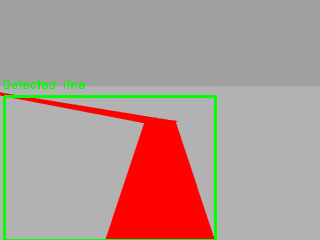
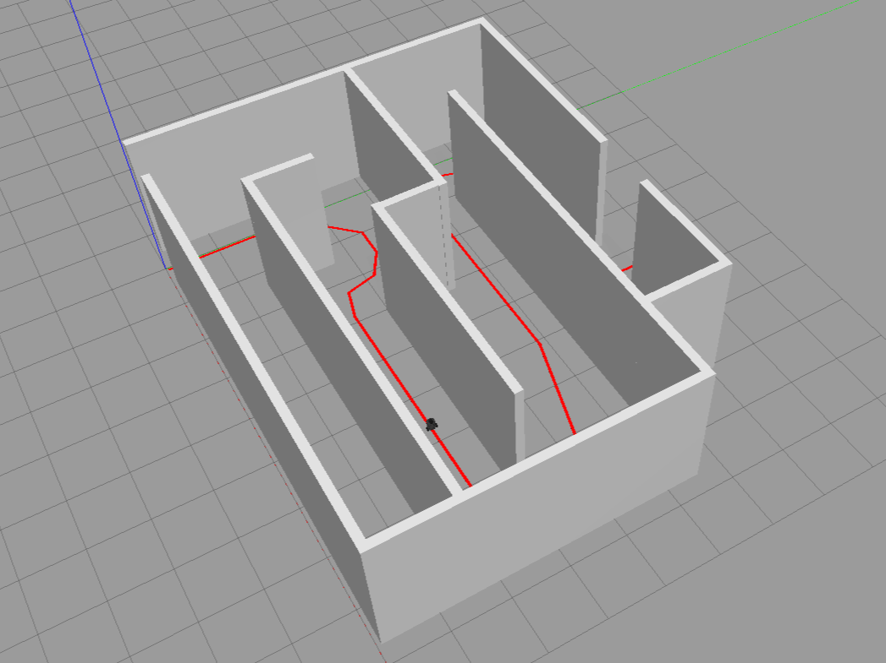
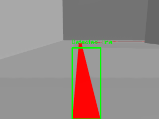
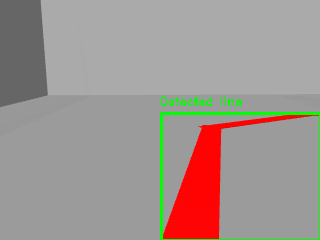

# TurtleBot3 Line Follower

This ROS Noetic project simulates (in Gazebo environment) or executes in real life a simple line follower module for TurtleBot3. The control of the robot is performed using the input of its real-time camera where vibrant colors (in order to make a difference from other colors in the environment) are detected. It also enables to record the robot camera with and without the detection bounding rectangle shown below.

All recordings are stored in _recordings_ directory, saving two files:
1. Raw camera view without editions: _raw_view.avi_
2. Camera view with a printed green bounding rectangle of the detection made: _detection.avi_

<br>

<p align="center">
  
</p>

<br>

<p align="center">
  
  
</p>

## Overview

The main purpose of a line follower module is to enable a robot to autonomously follow a path defined by a line or a boundary (in this simple case, a path defined by red tape). In general, a line follower module consists of a set of sensors, such as camera sensors, that can be used to detect the position of a line or a boundary. Based on the sensor data, the module then computes an appropriate control action, such as adjusting the speed and direction of the robot's movement, to keep the robot on the desired path.

Line follower modules are commonly used in robotics applications such as automated guided vehicles (AGVs), industrial robots, and unmanned ground vehicles (UGVs). They are particularly useful in situations where a robot needs to navigate along a predefined path, such as in manufacturing or warehouse environments.

## Dependencies

`
rospy
std_msgs
message_generation
opencv-python
numpy
catkin
`

## World

In order to perform the simulation, a maze-like world was created. This world contains some basic walls and a red path to follow as seen below.

<br>

<p align="center">
  
</p>

<br>

## How does it work?

Image processing techniques are performed from the images obtained from the robot camera, and the output is shown in the screen when executing the module. The image is scanned and processed calculating the Center Of Gravity (COG) of the detected colors in order to make decisions:
* Centered COG: straight
* Left COG: turn left
* Right COG: turn right
* No detection: stop

<br>

Below, three examples of the TurtleBot3 camera output can be seen:

<br>

<p align="center">
  
  
  
</p>

## Build

If you have no workspace directory, create one using the next comands in your command line:

```console
user@ubuntu:~$ mkdir your_ws
user@ubuntu:~$ cd your_ws
user@ubuntu:~/your_ws$ mkdir src
user@ubuntu:~/your_ws$ cd src
```

After creating your workspace directory you are ready to go. Clone this directory into your _src_ folder and build it using Catkin building packages. Run the next commands in your terminal:

```console
user@ubuntu:~/your_ws/src$ git clone https://github.com/jonmartinezdeaguirre/turtlebot3_line_follower.git
user@ubuntu:~/your_ws/src$ cd ..
user@ubuntu:~/your_ws$ catkin build
```

## Launch

Once your _src_ folder is build, the package is ready to use. To simply launch the TurtleBot3 in a real life environment you can run the next command:

```console
user@ubuntu:~/your_ws$ roslaunch line_follower line_follower.launch
```

However, in order to make a more complex launch of the module, some arguments can be added. In this case, the arguments are related to the simulation environment (Gazebo), recording and position/orientation of the TurtleBot3.

```
Arguments:
  * sim: runs Gazebo simulation (default=false)
  * rec: records raw camera view video, detection view is always recorded (default=false)
  * x: X axis position (default=0.025)
  * y: Y axis position (default=0)
  * z: Z axis position (default=0)
  * roll: roll angle orientation (default=0)
  * pitch: pitch angle orientation (default=0)
  * yaw: yaw angle orientation (default=1.570796)
```

Example of command line used to simulate in Gazebo environment and recording the output of the camera:
```console
user@ubuntu:~/your_ws$ roslaunch line_follower line_follower.launch sim:=true rec:=true
```
